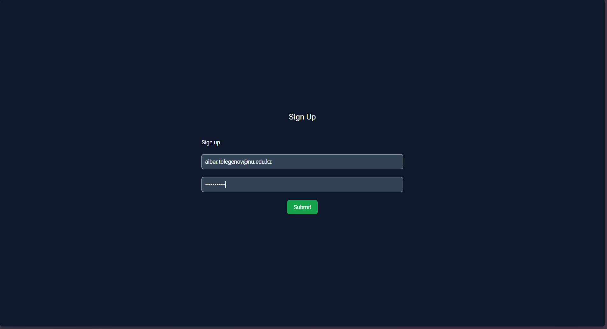
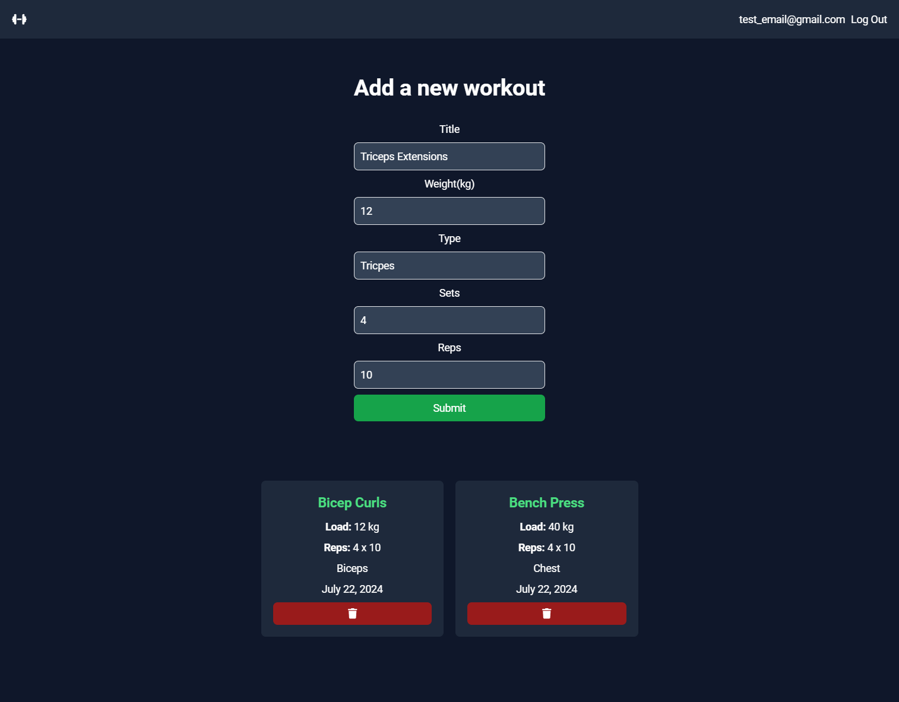

<h1 align="center" id="title">FitTrack</h1>
<p align="center"></p>
<p id="description">This is an user-friendly simple application to keep track of your workout/exercises. I decided to build this project to have my personal app to keep track of my workout.</p>

<h2>🧐 Features</h2>
Here are some of the project's best features:
- CRUD operations
- Save exercises:
- Weight, sets x reps, title, type
- Group exercises by muscle groups

<h2>🛠️ Installation Steps:</h2>

<p>1. Clone the project</p>
```
git clone https://github.com/oiibar/FitTrack.git
```

<p>2. Navigate to the client folder</p>

```
cd FitTrack/client
```

<p>3. Install client-side packages</p>

```
npm i
```

<p>4. Run the client</p>

```
npm run dev
```

<p>5. Navigate to the server folder</p>

```
cd FitTrack/server
```

<p>6. Install server-side packages</p>

```
npm i
```

<p>7. Run the server</p>

```
npm run dev
```

<h2>💻 Built with</h2>
<h3>Technologies used in the project:</h3>

- MongoDB
- ExpressJS
- ReactJS
- NodeJS
- CRUD operations
- TailwindCSS

<h3>Here are some screenshots of the project:</h3>
<p align="center">
  
  
</p>


<h2>💻 Project Documentation</h2>
<h3>Project Overview</h2>
FitTrack is a full-stack fitness tracking system built using the MERN stack.
It allows users to manage their workouts, store notes, analyze workout statistics, and securely access their data.

<h3>Key Features</h3>

- NoSQL database design
- Advanced MongoDB queries
- Aggregation pipelines
- Indexing and performance optimization


<h2>💻 System Architecture</h2>
<h3>The system follows a client–server architecture:</h3>

- React Client 
- REST API (Axios)
- Node.js + Express 
- MongoDB Driver 
- MongoDB Database

Frontend:
- React Context API for state management
- Axios for API communication
- TailwindCSS for styling

Backend:
- ExpressJS REST API
- JWT authentication middleware
- MongoDB Node.js Driver


<h2>💻 Database Schema Description</h2>
<h3>Users Collection</h3>

```
{
    "_id": "ObjectId",
    "email": "user@example.com",
    "password": "hashed_password"
}
```

<h3>Workouts Collection</h3>

```
{
    "_id": "ObjectId",
    "title": "Chest Day",
    "type": "Strength",
    "weight": 80,
    "sets": 3,
    "reps": 10,
    "notes": [
    "Felt strong today",
    "Increase weight next session"
    ],
    "user_id": "ObjectId",
    "deleted": false,
    "createdAt": "ISODate",
    "updatedAt": "ISODate"
}
```

- Notes are stored as an embedded array

- ```deleted``` flag enables soft delete

- Each workout belongs to a user


<h2>💻 MongoDB Queries</h2>
<h3>Create WorkoutItem</h3>

```
db.workouts.insertOne(workout)
```

<h3>Read Workouts</h3>

```
db.workouts.find({ user_id, deleted: { $ne: true } })
```

<h3>Update Workouts</h3>

```
db.workouts.updateOne(
  { _id, user_id },
  { $set: updatedAt: new Date() }
)
```

<h3>Add Note</h3>

```
db.workouts.updateOne(
  { _id, user_id },
  { $push: { notes: note } }
)
```

<h3>Soft Delete</h3>

```
db.workouts.updateOne(
  { _id, user_id },
  { $set: { deleted: true } }
)
```


<h2>💻 Aggregation Pipeline</h2>
<h3>WorkoutItem Statistics by Type</h3>

```
db.workouts.aggregate([
  { $match: { user_id, deleted: { $ne: true } } },
  {
    $group: {
      _id: "$type",
      totalWorkouts: { $sum: 1 },
      averageWeight: { $avg: "$weight" }
    }
  },
  { $sort: { totalWorkouts: -1 } }
])
```


<h2>💻 API Documentation</h2>
<h3>Workouts Endpoints</h3>

| Method | Endpoint                 | Description         |
| ------ | ------------------------ | ------------------- |
| GET    | `/api/workouts`          | Get all workouts    |
| GET    | `/api/workouts/:id`      | Get a workout       |
| POST   | `/api/workouts`          | Create workout      |
| PUT    | `/api/workouts/:id`      | Update workout      |
| DELETE | `/api/workouts/:id`      | Soft delete workout |
| PATCH  | `/api/workouts/:id/note` | Add note            |
| GET    | `/api/workouts/stats`    | WorkoutItem statistics  |

<h4>Add Note Example</h4>

```
PATCH /api/workouts/:id/note
Authorization: Bearer <token>

{
  "note": "Increased weight today"
}
```


<h2>💻 Security</h2>
- JWT authentication 
- Protected API routes 
- User-specific access control

<p>Feel free to contact me</p><a href="contact-me-neon.vercel.app">contact-me-neon.vercel.app</a>